# Enterprise Microservices System — Java, Spring Boot, Spring Security (Production‑Ready)

A complete, interview- and production-ready design document describing a Java + Spring Boot microservices system that addresses scalability, resilience, data consistency and low latency. Includes step-by-step explanations, Mermaid diagrams (architecture, sequences, flows), real-world challenges and mitigations, code/config examples, validation steps and interview talking points.

Contents
- Overview & Goals
- System Architecture (Mermaid + explanation)
- Request Flow (Sequence diagram)
- Money Transfer (Saga) Flow (Sequence diagram)
- Outbox/Event Publishing Flow (Sequence diagram)
- Key Concerns: Scalability, Resilience, Data Consistency, Low Latency
- Cross-cutting Concerns: Security, Observability, CI/CD & Canary
- Real-world Problems & Resolutions (concise cases)
- Troubleshooting runbook & validation steps
- Interview talking points & sample answers
- Appendix: code snippets & references

---

## Overview & Goals

This design targets enterprise scenarios (e.g., banking, payments) where:
- Strong correctness and auditability are required for money flows.
- High availability and low latency are business requirements.
- Microservices must be independently deployable and horizontally scalable.
- Security must be robust (OAuth2/OIDC, JWT, mTLS).
- Observability (metrics, logs, tracing) and safe deploys (canaries) are essential.

Non-functional goals:
- p95 latency targets (e.g., < 200ms for user-facing API)
- High throughput (thousands TPS)
- 99.95% availability
- Safe progressive deployments (5% → 10% → 25% → 100%)

---

## System Architecture (high-level)

Mermaid diagram: architecture overview showing clients, gateway, services, event bus, storage, observability and CI/CD.

```mermaid
flowchart LR
  subgraph Edge
    A[Clients<br/>(Web/Mobile)] -->|HTTPS| G[API Gateway<br/>(Auth filter, Rate Limiter)]
  end

  G --> LB[Service Mesh / Ingress]
  LB --> Auth[Auth Service<br/>(OIDC / JWKS)]
  LB --> PaymentSvc[Payment Service<br/>(Spring Boot)]
  LB --> AccountSvc[Account Service<br/>(Spring Boot)]
  LB --> LedgerSvc[Ledger Service<br/>(Append-only)]
  LB --> NotifSvc[Notification Service]

  subgraph Infra
    Kafka[Kafka / Event Bus]
    Redis[Redis (cache/idempotency)]
    Config[Config Server]
    Vault[Secrets (Vault/KMS)]
    DB1[(Account DB)]
    DB2[(Payment DB)]
    DB3[(Ledger DB)]
    Prom[Prometheus/Grafana]
    Tracing[OpenTelemetry / Jaeger]
    Logs[ELK / Loki]
  end

  PaymentSvc -->|write events| Kafka
  AccountSvc -->|RDBMS| DB1
  PaymentSvc -->|RDBMS + Outbox| DB2
  LedgerSvc -->|Append-only| DB3
  AnySvc --> Prom
  AnySvc --> Tracing
  AnySvc --> Logs
  G -->|CI/CD|CD[CI/CD Pipeline]
  CD -->|Deploys/Canary| LB
```

Explanation
- API Gateway handles TLS, authentication (validates JWT), WAF, rate-limiting.
- Service Mesh (optional) provides mTLS, traffic shifting, observability.
- Each service is stateless Spring Boot app owning its DB (database-per-service).
- Kafka used for asynchronous, durable events; outbox pattern ensures atomic DB write + event persist.
- Redis used for caching, idempotency keys and rate-limiter counters.
- Observability stack: Prometheus (metrics), Grafana (dashboards), Jaeger/OpenTelemetry (distributed traces), ELK/Loki (logs).
- Secrets stored in Vault/KMS; configuration via Config Server or Spring Cloud Config (or externalized with Kubernetes secrets).

---

## Request Flow: API call through Gateway to Service (Mermaid Sequence)

```mermaid
sequenceDiagram
  participant Client
  participant Gateway
  participant Auth as AuthService
  participant Payment as PaymentService
  participant Account as AccountService
  participant Kafka as Kafka
  participant DB as PaymentDB
  participant Tracing as Tracing

  Client->>Gateway: HTTPS POST /payments (Authorization: Bearer <jwt>)
  Gateway->>Auth: (optional) validate token or local JWKS check
  Auth-->>Gateway: 200 OK (claims)
  Gateway->>Payment: POST /internal/payments (forwarded token)
  Gateway->>Tracing: start trace (X-Trace-Id)
  Payment->>Account: GET /internal/accounts/{fromId} (with token)
  Account-->>Payment: 200 account info
  Payment->>DB: BEGIN TX; INSERT payment; INSERT outbox(event)
  DB-->>Payment: COMMIT
  Payment->>Kafka: flush outbox -> publish PaymentCreated event
  Kafka-->>Notif: PaymentCreated
  Notif->>Client: push notification
  Payment-->>Gateway: 201 Created
  Gateway-->>Client: 201 Created + Location
```

Explanation
- Gateway validates JWT locally using JWKS to avoid per-request remote introspection.
- Payment service validates business rules, writes to local DB and writes an outbox row in the same transaction to guarantee at-least-once event durability.
- Outbox publisher (separate process or service within Payment service) publishes events to Kafka and marks outbox rows as sent.
- Notification service consumes events asynchronously for notifications.

---

## Money Transfer Saga (Orchestrator) — Sequence

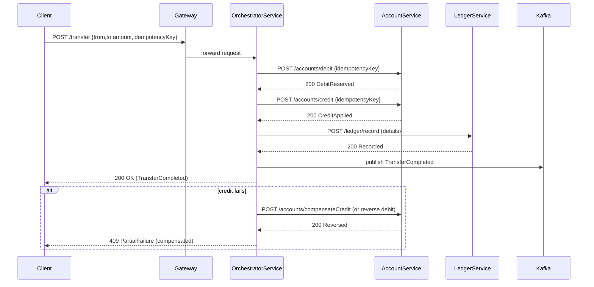

Explanation
- Orchestrated Saga: a coordinator (orchestrator) executes steps and triggers compensation on failure.
- Idempotency is used on each service call to avoid double application on retries.
- Ledger service provides immutable audit trail.

---

## Outbox / Event Publishing Flow

```mermaid
sequenceDiagram
  participant Service
  participant DB
  participant OutboxPublisher
  participant Kafka

  Service->>DB: BEGIN; INSERT business row; INSERT outbox(row,status=PENDING); COMMIT
  OutboxPublisher->>DB: SELECT * FROM outbox WHERE status='PENDING' LIMIT 100
  OutboxPublisher->>Kafka: publish events
  Kafka-->>OutboxPublisher: ack
  OutboxPublisher->>DB: UPDATE outbox SET status='SENT' WHERE id IN (...)
```

Notes
- Outbox pattern ensures event publications are not lost even if the publisher crashes; outbox rows persist until successfully published.

---

## Key Concerns & Patterns

We cover four main concerns: Scalability, Resilience, Data Consistency, Low Latency. For each: patterns, code/config examples, validation steps.

### 1) Scalability

Patterns
- Stateless services => horizontal scaling using Kubernetes pods & HPA.
- Partitioning (shard by account id) for write scale.
- Read replicas for read-heavy DB workloads.
- Async/queue-based decoupling (Kafka) to smooth spikes.
- Caching (Caffeine/Redis) for hot reads.

Example: HPA (Kubernetes)
```yaml
apiVersion: autoscaling/v2
kind: HorizontalPodAutoscaler
metadata:
  name: payment-svc-hpa
spec:
  scaleTargetRef:
    apiVersion: apps/v1
    kind: Deployment
    name: payment-svc
  minReplicas: 3
  maxReplicas: 50
  metrics:
  - type: Resource
    resource:
      name: cpu
      target:
        type: Utilization
        averageUtilization: 65
```

Cache (Caffeine) example (Spring Boot)
```java
@Bean
public Cache<String, AccountDto> accountCache() {
    return Caffeine.newBuilder()
        .maximumSize(10000)
        .expireAfterWrite(Duration.ofMinutes(15))
        .build();
}
```

Validation
- Load test with representative traffic (k6/Gatling) with autoscaling enabled.
- Monitor p95, queue lengths and pod scale behavior.

Interview tip
- Explain stateful vs stateless scaling and trade-offs for database partitioning.

---

### 2) Resilience

Patterns
- Circuit breakers, retry with exponential backoff + jitter (Resilience4j).
- Bulkheads to isolate failures per downstream resource.
- Timeouts on remote calls and thread-pool isolation.
- Graceful degradation (serve cached results).

Resilience4j config snippet
```yaml
resilience4j:
  circuitbreaker:
    instances:
      accountService:
        failureRateThreshold: 50
        waitDurationInOpenState: 30s
  retry:
    instances:
      accountService:
        maxAttempts: 3
        waitDuration: 200ms
```

Fallback example (Spring + Resilience4j)
```java
@CircuitBreaker(name="accountService", fallbackMethod="accountFallback")
public AccountDto getAccount(String id) { ... }

public AccountDto accountFallback(String id, Throwable t) {
    // return cached or default response
}
```

Validation
- Chaos testing to inject latency/failure (kill pods, add latency) and ensure fallbacks/circuit breakers work.

Interview tip
- Discuss backoff and jitter to avoid thundering herd.

---

### 3) Data Consistency

Patterns
- Database per service + local transactions (ACID inside service).
- Outbox + Kafka for cross-service eventual consistency.
- Sagas for multi-step operations with compensating actions.
- Optimistic locking (`@Version`) for low-contention updates; PESSIMISTIC locking (`SELECT FOR UPDATE`) for critical high-contention cases.

JPA optimistic locking example
```java
@Entity
public class Account {
  @Id private Long id;
  @Version private Long version;
  private BigDecimal balance;
}
```

Two-phase migration & schema evolution
- Add new column nullable
- Deploy new code that reads/writes safely
- Backfill data
- Make column non-null and remove legacy behavior

Validation
- Run integration tests for sagas under failures (drop a step), verify compensation.
- Confirm outbox successful publish and consumer idempotency.

Interview tip
- Explain why 2PC is avoided in microservices and how Saga/outbox provides practical alternatives.

---

### 4) Low Latency

Patterns
- Keep critical paths synchronous and optimized: avoid expensive sync work in controller threads.
- Use local JWT validation with JWKS and caching.
- Avoid blocking operations on event-loop threads (for reactive services).
- Use connection pools (HikariCP) and tune pool size.
- Use efficient data formats (binary protocols or JSON with small payloads) and compression cautiously.

JWT validation with JWKS (cache)
- Use libraries (Nimbus/JWT) or configure Spring Security resource server to use jwkSetUri with caching.

Timeouts & connection pool tuning
```yaml
spring:
  datasource:
    hikari:
      maximumPoolSize: 50
      connectionTimeout: 3000
```

Validation
- Measure p50/p95/p99 under load, tune GC (G1 or ZGC), and thread counts.

Interview tip
- Discuss tail-latency mitigation and the importance of p99 over average.

---

## Security (detailed)

Key elements
- Auth Service: OIDC provider issues JWT (RS256) with `kid`.
- Gateway validates JWT using JWKS and caches keys; propagate `Authorization` header to downstream.
- Internal service-to-service auth: mTLS + mutual auth in service mesh or internal tokens.
- Key rotation: Publish new keys in JWKS and keep old keys until tokens expire.

Spring Security (resource server) snippet
```java
@Configuration
public class SecurityConfig {
  @Bean
  SecurityFilterChain securityFilterChain(HttpSecurity http) throws Exception {
    http.authorizeHttpRequests(a -> a.anyRequest().authenticated())
        .oauth2ResourceServer(r -> r.jwt());
    return http.build();
  }
}
```

Idempotency (Idempotency-Key)
- Store Idempotency-Key in Redis with TTL and associated result or processing marker; return stored result if key seen.

Example pseudo-code
```java
String idempotencyKey = request.getHeader("Idempotency-Key");
if (idempotencyStore.exists(idempotencyKey)) {
    return idempotencyStore.get(idempotencyKey); // return cached response
}
idempotencyStore.markProcessing(idempotencyKey);
try {
  // process
  idempotencyStore.storeResult(idempotencyKey, response, ttl);
} finally {
  idempotencyStore.unmarkProcessing(idempotencyKey);
}
```

Security validation
- Run SAST & DAST in CI; check JWKS rotation in staging.

Interview tip
- Explain token validation local vs introspection trade-offs and key rotation lifecycle.

---

## Observability & Monitoring

Essential telemetry
- Business metrics (payments/sec, failed payments)
- Infrastructure metrics (CPU, memory, DB connections)
- JVM metrics (heap, GC)
- Traces (latency breakdown across services)
- Logs (structured with traceId, userId, service)

Prometheus example alert (p95 latency)
```yaml
- alert: PaymentLatencyHigh
  expr: histogram_quantile(0.95, sum(rate(http_server_requests_seconds_bucket{job="payment-svc"}[5m])) by (le)) > 1.0
  for: 5m
```

Tracing: propagate `traceparent` or OpenTelemetry headers from gateway through services.

Validation
- Inject faulty behavior and ensure alerts trigger and dashboards show degradation.

Interview tip
- Explain importance of SLOs and error budgets in release decisions.

---

## CI/CD & Canary Delivery (5% → 10% example)

Mermaid diagram showing canary pipeline

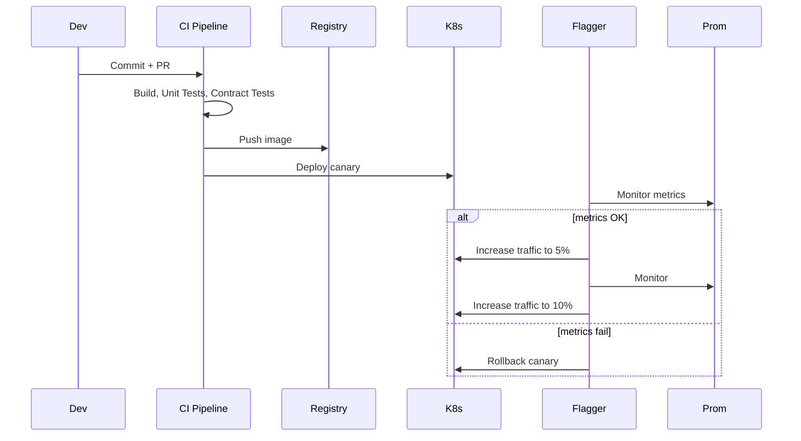

Key steps
1. Smoke & contract tests pass in CI.
2. Deploy canary with version label `v2` but route 0% traffic initially (warm-up).
3. Gradually increase traffic to 5% and monitor key metrics (error rate, p95 latency, business success rate).
4. If OK, increase to 10% then continue to higher steps; automatic rollback if thresholds breached.

Flagger/Argo Rollouts handles automation based on Prometheus metrics.

Validation
- Synthetic tests against canary, and monitor real traffic metrics.
- Confirm automatic rollback occurs on threshold breach.

Interview tip
- Discuss why gradual rollout reduces blast radius and how automated checks enable safe deployment.

---

## Real-world Problems & Short Resolutions

(Condensed; each idea maps to deeper sections above)

- N+1 in JPA → use DTO projection / join fetch / @EntityGraph.
- Memory leak due to ThreadLocal → ensure remove() in finally or adopt request-scoped beans.
- JWT failures on rotation → proper JWKS rotation with caching and TTL plus staged key rollout.
- DB deadlocks on transfers → canonical lock ordering + short transactions + retries.
- Thundering retries → add backoff with jitter, circuit-breakers and bulkheads.
- Gateway slow due to remote introspection → local JWT verification + cache; avoid synchronous introspection.
- Canary failures due to DB schema mismatch → two-phase schema migration (add nullable fields, deploy, backfill, make mandatory).
- Outbox publishing stuck → implement idempotent publisher and liquidation process to retry failed outbox rows.

---

## Troubleshooting & Runbook (quick checklist)

1. High latency / CPU:
   - Obtain thread dumps, JFR. Look for blocking system calls.
   - Check p95/p99 latencies in Prometheus.
2. Memory leak:
   - Generate heap dump (jmap), analyze with MAT dominator tree.
3. DB connection exhaustion:
   - Check Hikari metrics, long-running transactions, blocked queries.
4. Service unavailability:
   - Check readiness/liveness probes, pod events, crash loops.
5. Canary failure:
   - Rollback (Flagger/Argo rollback/route weight revert), collect traces, enable debug logs for canary pods.

---

## Interview Talking Points & Example Answers

Q: How do you guarantee correctness for a money transfer?
A: "We avoid distributed transactions (2PC) by designing a Saga: each step is idempotent and emits events; an orchestrator coordinates steps and compensates on failure. Use outbox to guarantee events are published atomically with DB changes."

Q: How do you handle JWT key rotation?
A: "Publish new key in JWKS alongside old one; configure resource servers to cache JWKS with reasonable TTL and refresh; rotate keys only after old tokens expire to avoid validation errors."

Q: How to prevent N+1?
A: "Never serialize managed entities directly. Use DTO projection (constructor expression), join fetch, or @EntityGraph; monitor SQL logs and test with high N."

---

## Appendix: Useful Code Snippets

- Spring Boot Security (JWT resource server): shown earlier.
- Resilience4j usage: shown earlier.
- Caffeine cache example: shown earlier.
- ThreadPoolExecutor pattern:
```java
ExecutorService executor = new ThreadPoolExecutor(
    20, 200, 60L, TimeUnit.SECONDS,
    new LinkedBlockingQueue<>(500),
    new ThreadPoolExecutor.CallerRunsPolicy());
```

- JPA entity versioning:
```java
@Entity
public class Account {
  @Id @GeneratedValue private Long id;
  @Version private Long version;
  private BigDecimal balance;
}
```

---

## References

- Spring Boot & Spring Security docs
- Resilience4j docs
- Kafka & Outbox pattern resources
- OpenTelemetry & Prometheus guides
- "Designing Data-Intensive Applications" — Martin Kleppmann

---

# Enterprise Microservices Architecture (Java, Spring Boot, Spring Security)

This document explains a **real‑world, production‑ready microservices system** built using **Java, Spring, Spring Boot, Spring Security, and Cloud‑native patterns**. It focuses on **scalability, resilience, data consistency, and low latency**.

---

## 1. High‑Level System Overview

### Key Goals
- Handle **high traffic** efficiently
- Ensure **fault tolerance & resilience**
- Maintain **data consistency** across services
- Provide **secure communication**
- Achieve **low latency**

### Core Technologies
- **Java 17+**
- **Spring Boot** – service development
- **Spring Security + OAuth2/JWT** – authentication & authorization
- **Spring Cloud** – service discovery & resilience
- **REST APIs + Kafka** – synchronous & asynchronous communication
- **Docker + Kubernetes** – deployment & scaling

---

## 2. Architecture Diagram

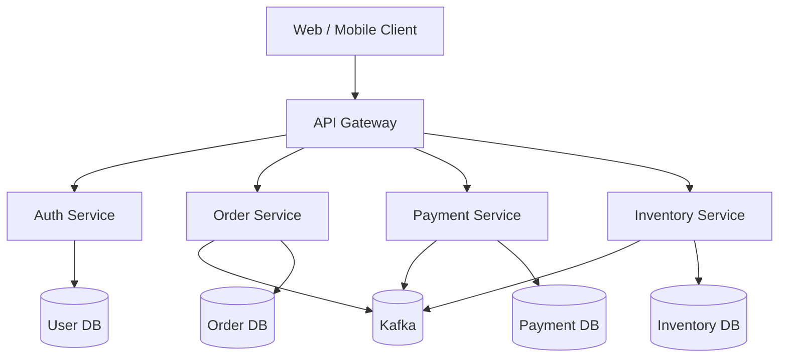

---

## 3. API Gateway (Single Entry Point)

### Responsibilities
- Central request routing
- Authentication & authorization
- Rate limiting & throttling
- Load balancing

### Implementation
- **Spring Cloud Gateway**

```java
@Bean
public SecurityWebFilterChain security(ServerHttpSecurity http) {
    http.authorizeExchange()
        .pathMatchers("/auth/**").permitAll()
        .anyExchange().authenticated()
        .and().oauth2ResourceServer().jwt();
    return http.build();
}
```

### Benefits
- Simplifies client communication
- Improves security
- Reduces duplication

---

## 4. Authentication & Security

### Flow
1. User logs in
2. Auth Service validates credentials
3. JWT token issued
4. Token sent with each request

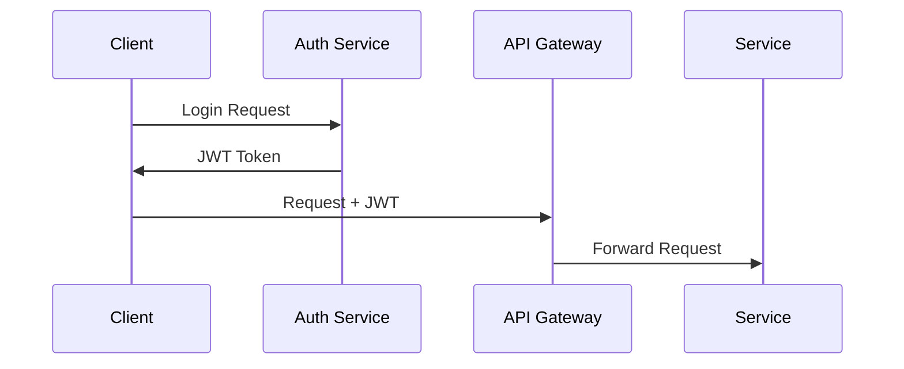

### Technologies
- **Spring Security**
- **OAuth2**
- **JWT**

---

## 5. Microservices Design

### Service Principles
- Each service owns its **own database**
- Independent deployment
- Loose coupling

### Example: Order Service

```java
@RestController
@RequestMapping("/orders")
public class OrderController {

    @PostMapping
    public Order create(@RequestBody Order order) {
        return orderService.createOrder(order);
    }
}
```

---

## 6. Database per Service Pattern

### Why?
- Avoids tight coupling
- Improves scalability
- Enables independent schema evolution

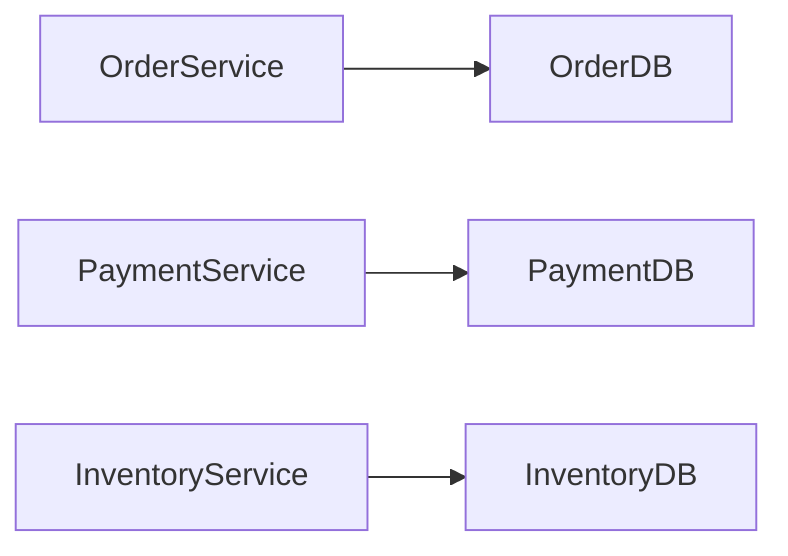

---

## 7. Data Consistency (Saga Pattern)

### Problem
Distributed transactions across services

### Solution: **Saga Pattern (Event‑Driven)**

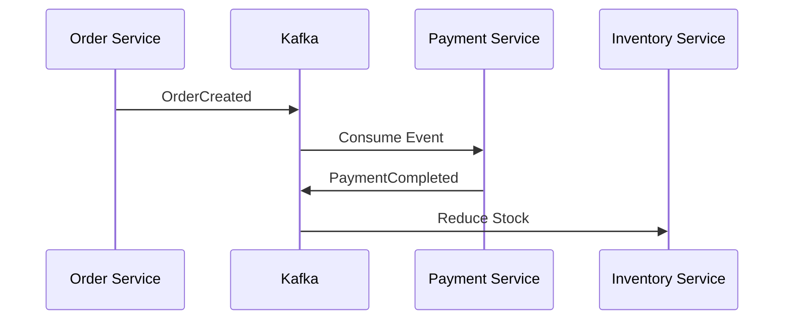

### Benefits
- No distributed locks
- Eventually consistent
- High availability

---

## 8. Asynchronous Communication (Kafka)

### Why Kafka?
- High throughput
- Loose coupling
- Fault tolerance

### Example Producer

```java
kafkaTemplate.send("order-events", orderEvent);
```

### Example Consumer

```java
@KafkaListener(topics = "order-events")
public void consume(OrderEvent event) {
    process(event);
}
```

---

## 9. Resilience & Fault Tolerance

### Patterns Used
- Circuit Breaker
- Retry
- Timeout
- Bulkhead

### Tool
- **Resilience4j**

```java
@CircuitBreaker(name = "paymentService", fallbackMethod = "fallback")
public Payment pay() {
    return paymentClient.pay();
}
```

---

## 10. Scalability & Performance

### Horizontal Scaling
- Kubernetes auto‑scaling
- Stateless services

### Caching
- Redis for frequently accessed data

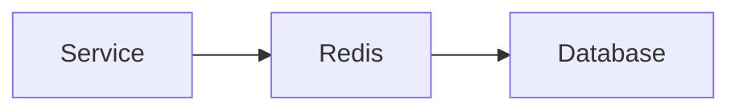

---

## 11. Observability & Monitoring

### Tools
- Spring Boot Actuator
- Prometheus
- Grafana
- ELK Stack

### Metrics
- Latency
- Error rate
- Throughput

---

## 12. Deployment Architecture (Senior-Level)

This section explains **server-level, container-level, and Kubernetes-level configuration** used in real-world enterprise systems.

### 12.1 Server-Level Architecture (Infrastructure)

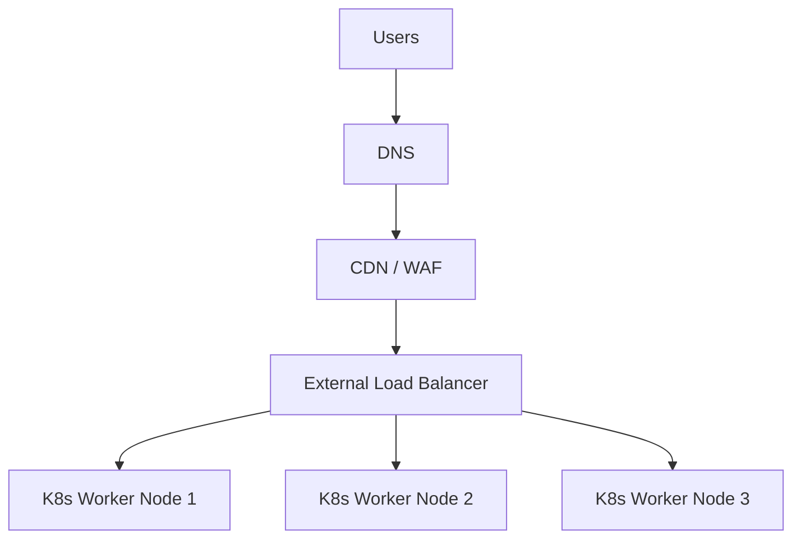

**Key Points (Senior Focus):**
- DNS routes traffic to nearest region
- CDN + WAF protects against DDoS & attacks
- Load Balancer distributes traffic across nodes
- Nodes run on EC2 / VM Scale Sets

---

### 12.2 Kubernetes Cluster Architecture

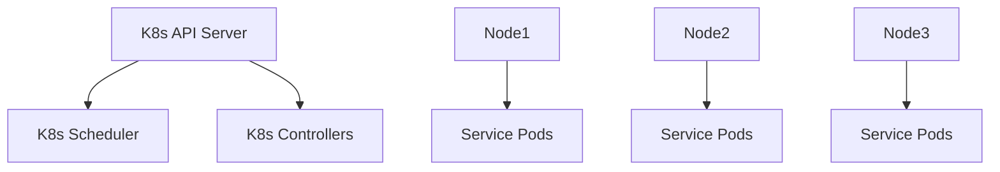

**Responsibilities:**
- API Server: Cluster brain
- Scheduler: Pod placement
- Controllers: Desired state reconciliation

---

### 12.3 Pod, Service & Load Balancing

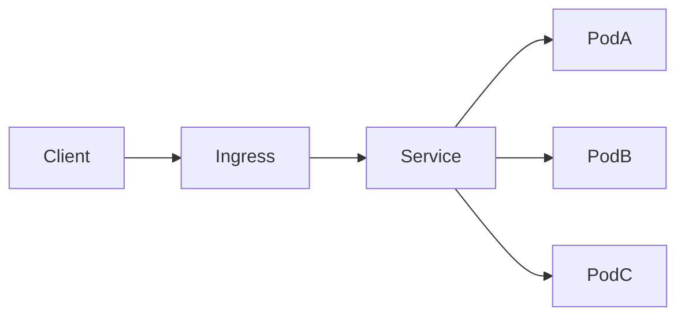

**How Load Balancing Works:**
- Ingress handles L7 routing
- Kubernetes Service provides L4 load balancing
- kube-proxy manages traffic rules

---

## 13. Load Balancing (Detailed)

### Levels of Load Balancing

1. **DNS Load Balancing** – geo routing
2. **External Load Balancer** – ALB / NLB
3. **Ingress Controller** – path & host routing
4. **Service Load Balancing** – pod-level

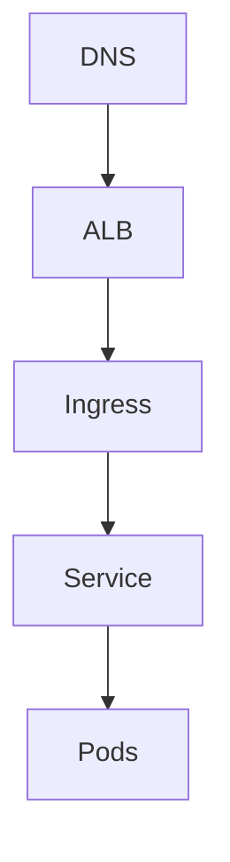

**Senior Interview Insight:**
- Stateless services enable horizontal scaling
- Sticky sessions avoided using JWT

---

## 14. mTLS (Mutual TLS) – Zero Trust Security

### Why mTLS?
- Prevents service impersonation
- Ensures encrypted service-to-service traffic
- Required in banking & fintech systems

### mTLS Flow

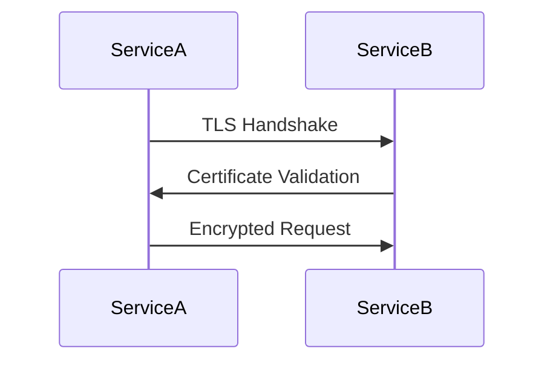

### Implementation Options
- Service Mesh (Istio / Linkerd)
- Spring Boot + custom certificates

---

### mTLS with Service Mesh

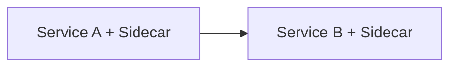

**Key Benefits:**
- Automatic cert rotation
- No code changes
- Policy-based security

---

## 15. Configuration Examples

### Kubernetes Deployment

```yaml
apiVersion: apps/v1
kind: Deployment
spec:
  replicas: 3
  template:
    spec:
      containers:
      - name: app
        image: app:1.0
```

### Horizontal Pod Autoscaler

```yaml
apiVersion: autoscaling/v2
kind: HorizontalPodAutoscaler
spec:
  minReplicas: 2
  maxReplicas: 10
```

---

## 16. End-to-End Request Flow (Senior View)

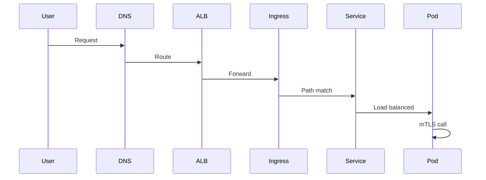

---


## 13. Key Advantages of This System

✅ Highly scalable
✅ Secure by design
✅ Fault tolerant
✅ Low latency
✅ Production proven architecture

---

## 14. When This Architecture Is Used

- E‑commerce platforms
- Banking & fintech systems
- Large enterprise SaaS products
- High‑traffic public APIs

---

## 15. Summary

This architecture demonstrates **real‑world Java & Spring expertise** and is commonly discussed in **senior‑level interviews**. It balances **performance, security, and maintainability** while remaining cloud‑native and future‑ready.

---

*End of Document*
